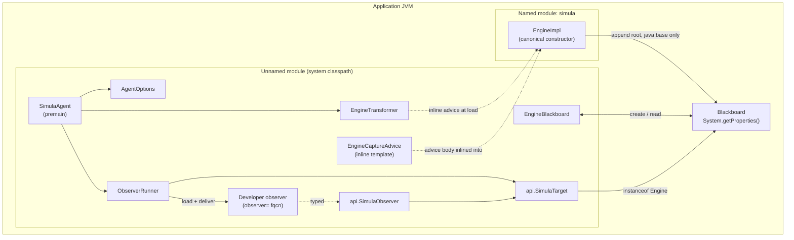
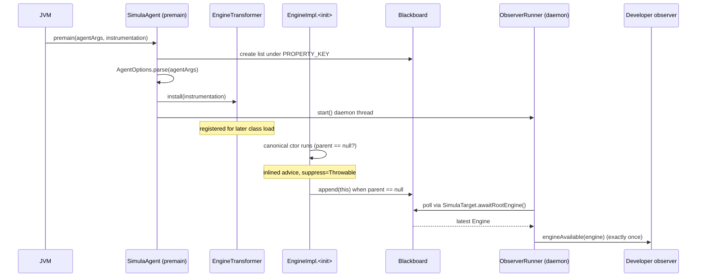

# Architecture — simula-agent

The `simula-agent` is a `-javaagent` that captures the **root** `jpnco.simula.Engine`
of a running simula application and hands it, typed as `Engine`, to a developer-supplied observer.
The host application and the framework jar are never modified: the agent instruments the framework
`EngineImpl` constructor at class-load time and communicates across the JPMS boundary through a
`java.base` blackboard.

## Design goals

- **Zero host intrusion**: no change to the application source or to the framework jar.
- **Typed, reflection-free data access**: the observer receives a real `Engine`; only a one-time
  reflective load instantiates the developer-named observer class.
- **Soft degradation** (Constitution IX): every instrumentation path is best-effort. A framework
  signature drift simply stops matching, so nothing is captured and the observer gets the
  not-available outcome — the host JVM is never harmed.
- **Cross-module visibility**: a named module cannot read the agent's unnamed module, so the two
  sides communicate only through a structure in `java.base`.

## Components

## Capture dataflow

## Key invariants

- **Root only.** The advice fires on the canonical `EngineImpl(String, Engine, int, ExecutionMode)`
  constructor and records the instance only when its `parent` argument is `null`. Every public
  constructor delegates to this one, so a single advice site sees all constructions while child
  engines are filtered out.
- **`java.base`-only advice.** The inlined advice references only `System.getProperties()` and
  `java.util.List`. The registry key is a `String` compile-time constant
  (`EngineBlackboard.PROPERTY_KEY`) that the Java compiler inlines, leaving no runtime reference to
  any agent type inside the transformed framework class.
- **Exactly-one outcome.** `ObserverRunner` delivers `engineAvailable` or `engineUnavailable` once and
  confines any observer exception (logged, never rethrown).
- **Named target by contract, not by link.** `EngineTransformer` matches `jpnco.simula.engine.EngineImpl`
  and its constructor structurally (4 arguments, `jpnco.simula.Engine` parent at index 1), so the
  agent compiles with a `provided` framework dependency and links to none of its bytecode.

## Instrumentation contract

The agent depends on one structural contract of the framework (documented in
`specs/001-engine-capture/contracts/capture-contract.md`): the canonical engine constructor keeps the
shape `(String, Engine, int, ExecutionMode)` with a `null` parent marking the root. If that shape
changes, matching fails and the agent degrades to "engine unavailable" — never an error in the host.

## Optional supervision

With the `supervise=true` option, a second load-time advice (`capture/SupervisionAdvice`) targets the
framework's documented instrumentation anchor `EngineImpl.checkSupervision()` and writes
`isSupervised = true` into that field at method entry (`@Advice.FieldValue(readOnly = false)`),
before the method body runs. The body then registers the framework's `SimulaSupervisor`. The inlined
write references only the instrumented type's own `boolean` field, so it stays valid inside the named
`simula` module and is suppressed on any `Throwable` (Constitution IX).
